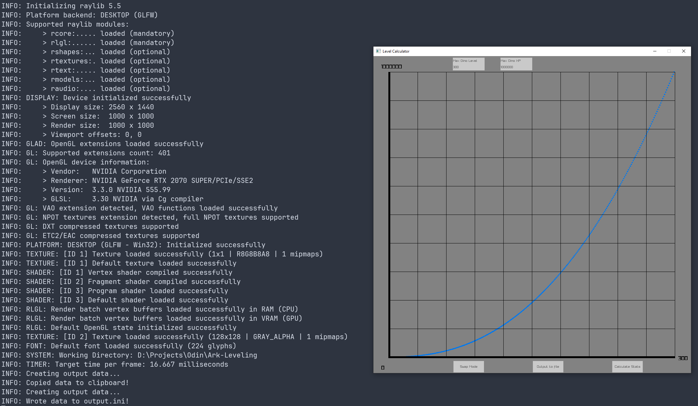

## About

This is a simple program that will calculated the `ExperienceRampOverrides` data for a given max level and xp with seperate modes for players and dinos. Press Ctrl-C to copy the data in .ini format to the system clipboard or press the ouput to file button to generate a file called output.ini in the current directory. Text input relies on cursor hover to work as it is implemented in an immediate mode fashion and is still a WIP

## Warning

This project is not entirely finished and requires some more fixes but should be fine on Linux and Windows

## Examples:
Here is an example of the leveling data for a max level of 300 and max experience of 1,000,000:

